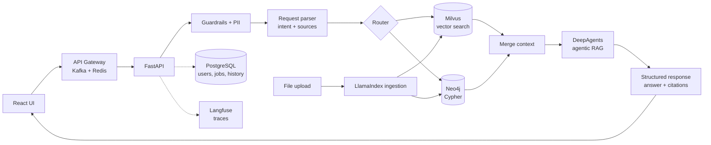

# Rivet KAG | Agent that talks to your vector and graph data

**Knowledge-Augmented Generation (KAG) over your own data.** Ask questions in natural language and get answers grounded in both a **vector store (Milvus)** and a **knowledge graph (Neo4j)**, with citations and source text for every claim.

> Status: early stage. The chat UI, API contract, sample data, upload tooling, a Data Management view, real Milvus/Neo4j retrieval, an LLM request router, a DeepAgents answerer with Pydantic-validated output (with a provider picker: Anthropic/OpenAI/local Ollama), regex-based PII masking, JWT auth, Postgres-backed chat history/audit log/ingestion jobs, a Redis response cache, Kafka event publishing and local-only Langfuse tracing all work — the LLM pieces behind `ANTHROPIC_API_KEY` or the selected provider's credentials — with a 10/10 retrieval-accuracy check (see [Real retrieval, routing and answering](#real-retrieval-routing-and-answering) and [Platform: auth, history and messaging](#platform-auth-history-and-messaging)). Full cost instrumentation and the richer trace field set are still a design, not code — see [Production readiness](#production-readiness).

<!-- TODO: demo GIF -->

## Features

- Q&A chat with cited answers (vector chunks and graph facts, with source text)
- Data Management tab: browse everything stored in Milvus and Neo4j
- Upload utilities to load your own data into both databases (`utils/`)
- Hybrid retrieval: semantic search (Milvus) and Cypher queries (Neo4j) run in parallel
- Input guardrails and regex-based PII masking, always on, before anything reaches an LLM
- Agentic RAG (DeepAgents) with Pydantic-validated structured output
- LLM-as-a-judge script (`evals/judge.py`) grading real pipeline answers against a reference
- Upload Excel, CSV, Markdown and PDF files, ingested through LlamaIndex
- JWT auth (register/login/me), Postgres-backed chat history, audit log and ingestion job tracking
- Redis response caching and Kafka event publishing, both best-effort — never block or fail a request
- Local-only Langfuse tracing (never Langfuse Cloud) and evals (`make eval`, `make judge`; DeepEval is still planned)
- Planned: agent actions (change data, analysis and plots), cost budgets, release gates and the richer trace field set — see [Production readiness](#production-readiness)

## Architecture



### Request flow

1. User sends a request from the UI
2. The request is parsed to find the core need and the data sources to use
3. PII is detected and masked
4. The router decides what to query: Milvus, Neo4j (Cypher), or both
5. Vector and graph retrieval run in parallel
6. Results are merged into a single context
7. The context goes to the agentic RAG layer (DeepAgents), grounded strictly in the retrieved citations
8. The answer is produced as a validated Pydantic structure (`AgentAnswer`: answer, citations used, confidence)
9. The UI shows the answer with citations and source text

### Tech stack

| Layer             | Choice                          |
| ----------------- | ------------------------------- |
| Frontend          | React + TypeScript (Vite)       |
| Backend           | FastAPI                         |
| Gateway / async   | Kafka, Redis (cache + sessions) |
| LLM orchestration | LangChain, DeepAgents           |
| Ingestion         | LlamaIndex                      |
| Vector DB         | Milvus                          |
| Graph DB          | Neo4j                           |
| Relational DB     | PostgreSQL                      |
| Guardrails        | Middleware on input             |
| Observability     | Langfuse                        |
| Evals             | DeepEval                        |
| Packaging         | uv (Python), npm (frontend)     |

## Quickstart

No Docker. You need [uv](https://docs.astral.sh/uv/) (installs Python 3.12 itself), Node 18+, and [Neo4j](https://neo4j.com/), [PostgreSQL](https://www.postgresql.org/), [Redis](https://redis.io/) and [Kafka](https://kafka.apache.org/) installed locally — all via Homebrew, all run as background services, the same pattern throughout this project. Milvus runs embedded (Milvus Lite) from a local file, so there is nothing to install for it.

```bash
brew install neo4j postgresql@16 redis kafka         # once; neo4j and kafka need a JDK, Homebrew pulls one in
neo4j-admin dbms set-initial-password rivet-dev-password   # once, before Neo4j's first start
createuser -s rivet && createdb -O rivet rivet        # once, creates the app's Postgres role + database
make platform                                        # start neo4j, postgres, redis and kafka as background services
make install                                         # uv sync + npm install
make ingest                                          # load source_data/ into Milvus and Neo4j
make dev                                             # API http://localhost:8000 (docs at /docs) and UI http://localhost:5173
```

Connection settings live in `.env` (copy `.env.example`); the defaults match the commands above. Postgres tables are created automatically on startup (`Base.metadata.create_all`, not a migration tool — see `src/db/models.py`). `make test lint` runs the checks; the test suite never touches any of these services — see [Platform](#platform-auth-history-and-messaging).

After the one-time setup above, `make up` is a single command for routine local dev: it starts the four brew services if they aren't already running, polls their ports until each actually accepts a connection (not just until `brew services start` returns — Postgres/Neo4j/Kafka can take a few seconds to come up from cold), then runs `make dev`. This is deliberately not Docker — see `CLAUDE.md`'s "Stack and why" for why Docker was dropped from this project and isn't coming back for routine dev.

API: `POST /api/chat` with `{"session_id": "...", "message": "..."}` returns `{answer, citations[], trace[]}`. `/api/data/*` feeds the Data Management tab. `POST /api/files` ingests an uploaded file (see [Uploading files](#uploading-files)). `/api/auth/register`, `/login` and `/me` handle JWT auth (see [Platform](#platform-auth-history-and-messaging)).

## Sample data

`source_data/` holds a synthetic company dataset: `vector_data/` (Markdown + CSV for Milvus) and `graph_data/` (node/relationship CSVs for Neo4j). See [source_data/README.md](source_data/README.md) for what is in it. Open `source_data/index.html` in a browser to explore it.

### Loading data into the databases

```bash
make ingest   # embed and load source_data/ into both (first run downloads a ~130 MB embedding model)
```

Milvus Lite keeps its data in `data/milvus.db`. The API and the upload CLI open it one operation at a time, so you can run `make ingest` while `make dev` is running.

`utils/` also handles manual uploads: `uv run python -m utils.upload --help`. For example `vector files my_notes.md report.xlsx manual.pdf`, `vector text "..." --source note`, `graph node Employee id=E13 name="Ada"`, `graph rel MEMBER_OF Employee:E13 Team:TM1`. Everything stored is visible in the **Data Management** tab of the UI.

### Uploading files

`POST /api/files` (multipart, field name `file`) accepts `.md`, `.csv`, `.xlsx`/`.xls`, `.pdf` and `.txt`, chunks it with [LlamaIndex](https://docs.llamaindex.ai/) readers, embeds the chunks and upserts them into Milvus — the same collection `make ingest` and the Data Management tab use:

```bash
curl -F "file=@notes.md" http://localhost:8000/api/files
# {"filename":"notes.md","doc_type":"md","chunks_upserted":3}
```

Markdown is split one chunk per `##` heading; CSV and Excel one chunk per row (via LlamaIndex's `PagedCSVReader` / `PandasExcelReader`); PDF one chunk per page (via `PDFReader`). Unsupported types get a 400, and a file with no extractable text gets a 422.

## Real retrieval, routing and answering

By default (`USE_STUBS=true`) the chat pipeline uses canned retrievers so it works with no databases running. Set `USE_STUBS=false` in `.env` (with `make neo4j` and `make ingest` already done) to switch `/api/chat` to real retrieval:

- **Vector (`src/pipeline/retrieval/milvus.py`)** — embeds the question and runs a cosine ANN search over the ingested chunks, returning the top 4 as citations with their similarity score.
- **Graph (`src/pipeline/retrieval/neo4j.py`)** — a lightweight, keyword-based Cypher *generator*: it strips stopwords from the question, builds a query that matches nodes whose `name`/`title`/`id` contains one of the remaining keywords, and returns each match's direct relationships as a citation (e.g. `Priya Nair (Employee) -[:LEADS]-> Data Platform (Team)`). This isn't an LLM-based NL-to-Cypher translator — see the router below for that — but the query really is built from the question and executed against Neo4j, not fixed.

Independently, set `ANTHROPIC_API_KEY` in `.env` to switch on two LLM-backed stages — neither needs the databases running, so both work with `USE_STUBS=true` too:

- **Request parser and router** (`src/pipeline/parsing/router.py`, LangChain + Claude) — classifies the question's intent and decides which retriever(s) to query, instead of always querying both. Uses `with_structured_output` against a small `RouterDecision` schema (`intent`, `sources`), so the model's choice is validated, not parsed out of free text. Anthropic-only; not affected by `LLM_PROVIDER`.
- **Answerer** (`src/pipeline/answering/agent.py`, [DeepAgents](https://docs.langchain.com/oss/python/deepagents/overview)) — synthesizes the final answer from the merged citations, constrained to a Pydantic `AgentAnswer` schema (`answer`, `citation_ids` — which context items it actually used, `confidence`). The system prompt instructs it to answer only from the given context and say so plainly when the context doesn't cover the question, rather than guess. Its model backend is picked by `LLM_PROVIDER` (`anthropic` default, `openai`, or `ollama` for a local server) — see [Model router](#model-router) below.

Both stages fail the same way: if the call fails (bad key, timeout, malformed output) it's caught and logged, and the stage falls back to something safe — the router falls back to querying both sources, the answerer falls back to showing the retrieved citations without synthesis. A bad LLM response degrades the answer, it never 500s the request; verified live against a real, deliberately invalid key for both stages.

### Model router

`LLM_PROVIDER` in `.env` picks the answerer's model backend — `anthropic` (default, needs `ANTHROPIC_API_KEY`), `openai` (needs `OPENAI_API_KEY`), or `ollama` (a local server at `OLLAMA_HOST`, default `http://localhost:11434`, no key). `src/pipeline/answering/agent.py`'s `_build_model` maps the provider to `ChatAnthropic`/`ChatOpenAI`/`ChatOllama`; `src/pipeline/factory.py`'s `_answerer_has_credentials` decides, per provider, whether the real `DeepAgentAnswerer` or `StubAnswerer` is used (Ollama always counts as "has credentials" — it's a local service, not a keyed API, the same reasoning as the always-real PII masker). The request parser/router stays Anthropic-only; switching `LLM_PROVIDER` only changes the answerer. Only the Anthropic path has been exercised against a live endpoint (a deliberately invalid key, real 401) — OpenAI and Ollama are untested beyond mocked unit tests and offline construction.

PII masking (`src/guardrails/pii.py`) is always on, independent of any API key — it's regex-based (email, phone, card and SSN-shaped strings get replaced with a `[REDACTED_...]` placeholder) and runs before the message reaches the router or the answerer, so masking never depends on having an LLM available. Input guardrails (`src/guardrails/input.py`) block a short list of prompt-injection phrasings before the pipeline runs at all.

`evals/check_retrieval.py` is a 10-question accuracy check against the *live* databases (unlike the mocked unit tests, it proves the retrievers find the right thing in the sample data). Run it with `make eval` after `make ingest`:

```
$ make eval
[PASS] What is the meal expense limit while travelling?
       expected top source 'expense_policy.md', got 'expense_policy.md — Limits'
...
10/10 correct (100%)
```

`evals/judge.py` (`make judge`) goes further: it runs the *actual* pipeline end to end — real retrieval, real router, real DeepAgents answer — and has Claude grade each answer against a reference (see [LLM-as-a-judge](#llm-as-a-judge)). Needs `ANTHROPIC_API_KEY` and costs real money to run (one answering call plus one judging call per question). Its request shape has been checked against the live API with an invalid key (a real 401 comes back, not a malformed-request error), but it hasn't been run end to end with a valid key yet.

Both scripts are hand-rolled precursors to the "DeepEval, 25 golden questions" Phase 4 item — same idea, smaller and framework-free.

## Platform: auth, history and messaging

Phase 3. No stub/real split here — unlike the LLM pipeline stages, there's no meaningful "fake Postgres"; these pieces are real whenever the app runs, and are each written to degrade gracefully rather than need a flag.

- **Auth** (`src/auth/`, `POST /api/auth/register`, `/login`, `GET /me`) — email/password with Argon2 hashing (`passlib`), stateless JWTs (`pyjwt`, `JWT_SECRET`/`JWT_TTL_MINUTES` in `.env`). `/api/chat` and `/api/files` accept an optional `Authorization: Bearer` header — logged-in activity is attributed to the user, anonymous requests still work exactly as before. No server-side session store: a stateless JWT needs none, which is why Redis's role here is caching, not sessions, despite "Redis (cache, sessions)" in the architecture diagram.
- **Postgres** (`src/db/`, four tables — see `models.py`) — `users`; `chat_history` (one row per exchange, what a signed-in user could see of their own past chats); `chat_audit_log` (append-only, only ever stores the PII-*masked* question, richer fields than `chat_history`: outcome, sources queried, duration); `ingestion_jobs` (one row per `/api/files` upload, including failures). Tables are created with `Base.metadata.create_all` on startup, not Alembic migrations — the simpler, demo-appropriate choice.
- **Redis** (`src/clients/redis.py`) — `/api/chat` caches a response by a hash of the PII-masked question (keyed to the current `USE_STUBS`/`ANTHROPIC_API_KEY` mode, so switching modes never serves a stale-mode answer), TTL `RESPONSE_CACHE_TTL_SECONDS` (default 300s). A cache hit skips the whole pipeline — in `chat_audit_log`, `outcome="success_cached"` with `duration_ms=0` marks it.
- **Kafka** (`src/clients/kafka.py`) — publishes a `rivet.chat.completed` event (session, user, citation count, sources queried, duration) after every successful, non-cached chat response. Fire-and-forget: the HTTP response doesn't wait on it.

**All four of these are best-effort on the request path** — Postgres writes, the Redis cache, and the Kafka publish are each wrapped so a failure is logged and swallowed, never raised. A `/api/chat` call degrades to "no history/cache/event for this one request," it never 500s because a platform service is down; verified by pointing all three at unreachable hosts and confirming chat still returns 200. The *test suite* never talks to a live Postgres/Redis/Kafka at all: `tests/conftest.py`'s `db_session` fixture swaps in a real, in-memory SQLite database (genuine CRUD behavior, no live Postgres needed), and Kafka publishing is autouse-mocked for every test — the first version of that mock was itself a bug fix: a module-cached `AIOKafkaProducer`, once started inside one `pytest-asyncio` test's event loop, hangs forever if a later test (its own, different event loop) reuses it. Invisible in production, where uvicorn keeps one event loop for the app's whole life; see `tests/conftest.py` for the full story.

## Production readiness

Design targets for cost, quality and observability, tracked in the [roadmap](#roadmap) (Phase 4). Real retrieval, routing, answering and the Phase 3 platform pieces all exist now (see above); a bare-bones `chat_audit_log` is real too (see below). What's still a design, not code: per-call cost accounting, release-gate enforcement, alerting, and the richer trace field set. Nothing currently measures or enforces the numbers in this section — they're starting points to retune once there's real traffic and real measurement.

### Cost controls (tokenomics)

One **inspection** = one `/api/chat` request/response cycle. Target: **≤$0.15/inspection**, split into a per-stage budget so no single stage can blow the total (prices are current Claude API rates — Sonnet 5 $2/$10 per MTok in/out, Haiku 4.5 $1/$5):

| Stage                     | Spend driver              | Budget            | Notes                                                                                                                |
| ------------------------- | ------------------------- | ----------------- | -------------------------------------------------------------------------------------------------------------------- |
| PII masking               | —                        | $0.00             | Regex/NER, no LLM call — masking is a bad place to spend tokens                                                     |
| Parse/route               | small classification call | ≤$0.01           | Structured output, ~300 in / 100 out tokens. Use Haiku 4.5, not Sonnet — classification doesn't need a bigger model |
| Retrieve (vector + graph) | —                        | $0.00             | Local embedding (fastembed) + rule-based Cypher generation; only infra cost, no per-token spend                      |
| Merge / ROI-compress      | optional reranker         | ≤$0.005          | See below                                                                                                            |
| Answer synthesis          | agentic RAG               | ≤$0.12           | The dominant cost: cached system prompt + tool schemas, capped and compressed context                                |
| **Total**           |                           | **≤$0.15** | Reject or fall back to a retrieval-only answer if the pre-flight estimate exceeds this                               |

- **Pre-flight estimation** — before the answerer call, run `messages.count_tokens` on the assembled prompt and skip the agent (return retrieval-only citations) rather than let an oversized prompt blow the budget after the fact.
- **Actual cost accounting** — after every LLM call, read `response.usage` (`input_tokens`, `output_tokens`, `cache_read_input_tokens`, `cache_creation_input_tokens`) and multiply by the model's per-token price to get a real `cost_usd` for that stage. This is what lands in the trace — see [Observability and audit trail](#observability-and-audit-trail).
- **Caching** — the answerer's system prompt and tool schemas are stable across requests; cache them (`cache_control: {type: "ephemeral"}`) so repeat requests pay roughly a tenth of the input cost for that portion. Watch `cache_read_input_tokens` — if it's zero across repeated requests, something is silently invalidating the prefix (a timestamp or unsorted JSON in the system prompt is the usual cause).
- **ROI compression** — before merged context reaches the answerer, rank citations and keep only the highest-value ones per token: drop low-relevance chunks, cap total context (default 2,000 tokens). This is `merge_context` (`src/pipeline/merge.py`): dedupe by id, rank by retriever score (unscored citations sort last), then greedily fill the token budget (cheap char-based estimate, no LLM call) — always keeping at least one citation even if it alone exceeds the budget. There's no summarization step; chunks are kept verbatim or dropped.
- **Job-level limits** — $0.15 is a per-request cap. Separately cap spend per session (e.g. $1/user/day) and per batch job (eval/judge runs, e.g. $5/run), each with a hard circuit breaker: a job that exceeds its budget mid-run stops, it doesn't degrade silently.

### Evaluation and release gates

A release (prompt change, retriever change, or model swap) ships only when every **blocking** gate below passes against the golden set (`evals/golden_questions.json` — 10 retrieval questions today, growing toward the 25-question DeepEval set in the roadmap). **Warn** gates are reported, not enforced.

| Dimension         | Metric                                                             | Target                             | Gate                                                                      |
| ----------------- | ------------------------------------------------------------------ | ---------------------------------- | ------------------------------------------------------------------------- |
| Retrieval quality | top-1 hit rate (`evals/check_retrieval.py`)                      | ≥90%                              | Blocking                                                                  |
| Answer quality    | LLM-judge correctness score, 1–5 (see below)                      | mean ≥4.2, no individual score <3 | Blocking                                                                  |
| Citation          | factual claims traceable to a cited snippet                        | 0 hallucinated citations           | Blocking                                                                  |
| Citation          | claims with no citation at all                                     | ≤5% of claims                     | Blocking                                                                  |
| Latency           | P50 end-to-end`/api/chat`                                        | ≤2.5s                             | Warn >2.5s, blocking >5s                                                  |
| Latency           | P95 end-to-end                                                     | ≤6s                               | Warn >6s, blocking >10s                                                   |
| Cost              | mean $/inspection over the golden set                              | ≤$0.15                            | Warn >$0.15, blocking >$0.20                                              |
| HITL              | sampled human review of production answers (5% of traffic, weekly) | ≥90% rated acceptable             | Below 90% blocks the next release until reviewed                          |
| HITL              | escalation rate ("I don't know" / handoff to a human)              | within 2× the 7-day baseline      | Blocking if exceeded — usually signals a retrieval or routing regression |

### LLM-as-a-judge

Golden-string matching — what `evals/check_retrieval.py` does — only works for retrieval: it checks "did the right source come back", not "is the final answer correct." A synthesized answer has to be judged, not string-matched; this is what feeds the Answer quality and Citation rows above.

- **Implemented today** — `evals/judge.py` (`make judge`) runs the real pipeline against each golden question, then has a Claude judge call score the answer 1–5 against `golden_questions.json`'s `reference_answer`, using a `JudgeVerdict` schema (`score`, `passed`, `rationale`) so the grade is structured, not parsed out of free text. It's the interim version of the item below — a single correctness score, no separate citation-faithfulness or completeness dimensions yet, and it isn't wired into CI or a release gate.
- **Planned upgrade** — [DeepEval](https://docs.confident-ai.com/)'s `GEval` and `FaithfulnessMetric`, backed by a Claude judge call against a fuller rubric (correctness vs. reference, citation faithfulness, completeness) rather than a single score.
- **Judge independence** — prefer a different model tier for judging than for answering where practical (e.g. Sonnet judges a Haiku-tier answer), to reduce self-preference bias; where the same model must judge itself, lean on the rubric's structure rather than the judge's raw opinion.
- **Output** — a structured score (1–5) per dimension plus a short rationale, stored in the trace so a failing release gate points at *why*, not just *that* it failed.
- **Cost** — judge runs are an offline/batch job, not counted against the $0.15/inspection budget; tracked under the batch-job cap in [Cost controls](#cost-controls-tokenomics) instead.

### Observability and audit trail

**Langfuse tracing is implemented and local-only** (`src/clients/langfuse.py`, wired into `Pipeline.run()` in `src/pipeline/orchestrator.py`). `_is_local()` refuses any host that isn't `localhost`/`127.0.0.1` — it will never send a trace to Langfuse Cloud, regardless of `LANGFUSE_HOST`. There's no bundled local Langfuse server (self-hosting it needs Postgres + ClickHouse + Redis + object storage, which doesn't fit this project's brew-services-only platform story — see `CLAUDE.md`'s "Stack and why"); run your own self-hosted instance to see traces (https://langfuse.com/self-hosting). Without one, every span attempt fails to connect and is logged as a warning by Langfuse's own exporter — same "best-effort, never breaks the request" treatment as Postgres/Redis/Kafka (see [Platform](#platform-auth-history-and-messaging)): `traced_span()` degrades to a no-op context manager (`_NullSpan`) whenever the client is absent or a call fails, verified by `tests/test_tracing.py`.

**Per-request trace** (one root span per `Pipeline.run()` call, `as_type="chain"`) — implemented fields:

| Field                                     | Description                                                            |
| ------------------------------------------ | ------------------------------------------------------------------------ |
| `session_id`                             | set in metadata at span start and again on every update                  |
| `input`                                  | the PII-masked question — set only after the "pii" stage, never `req.message` directly, so `question_raw` never reaches the trace |
| `output`                                  | the final answer text                                                    |
| `sources_queried`, `intent`            | which of vector/graph were queried, and the router's intent classification |
| `citations_count`                        |                                                                          |
| `outcome`                                 | `success` / `guardrail_blocked` / `error`                          |

Not yet implemented (needs the pending cost-accounting work — see [Cost controls](#cost-controls-tokenomics)): `total_latency_ms`/`total_cost_usd` as distinct rollup fields (the per-stage `duration_ms` values are there, just not pre-summed), token counts, and a `fallback_used` outcome value (the router/answerer's own fallback is logged but not yet surfaced into this field).

**Per-stage trace** (one child span per `timed()` call in the orchestrator, automatically nested under the request's root span via Langfuse's OTel context) — implemented: `name`, `detail` (as metadata), `duration_ms` (as output) — exactly what `StageTrace` in `src/schemas/chat.py` already carries, nothing invented. Not yet implemented: `model`, `input_tokens`/`output_tokens`/`cache_read_tokens`, `cost_usd`, `fallback_triggered`, `query_used`/`num_results`/`top_score`, `keywords`/`num_nodes_matched`, `error` detail — these need either the pending cost-accounting work or widening the `Retriever`/`RequestParser` protocols to expose more than they return today.

**Audit log** — append-only Postgres `chat_audit_log` is real (see [Platform](#platform-auth-history-and-messaging)), one row per request. It only stores `question_masked`, never the raw question — the audit trail must not become a second place PII leaks from. What's still a design, not code: 90-day retention (no expiry job runs yet), and the richer field set below (tokens, cost, cache state) — today's table has `session_id`, `user_id`, `question_masked`, `answer`, `sources_queried`, `citations_count`, `outcome`, `duration_ms`.

**Alert conditions**:

| Condition                                   | Threshold                  | Action                                                                         |
| ------------------------------------------- | -------------------------- | ------------------------------------------------------------------------------ |
| Mean cost/request, 15 min rolling           | >$0.15                     | Warn                                                                           |
| Mean cost/request, 15 min rolling           | >$0.30                     | Page + force the cheaper model / stub answerer                                 |
| P95 latency, 5 min                          | >6s                        | Warn                                                                           |
| P95 latency, 5 min                          | >15s                       | Page                                                                           |
| 5xx / guardrail-block rate, 10 min          | >2%                        | Warn                                                                           |
| 5xx / guardrail-block rate, 10 min          | >10%                       | Page + auto-rollback to the previous prompt/model version                      |
| Router fallback rate, 30 min                | >20%                       | Warn — LLM router likely failing or misconfigured                             |
| Empty-result rate (vector or graph), 30 min | >15%                       | Warn — index or data problem                                                  |
| Judge-flagged hallucination rate, daily     | >5% of sampled answers     | Page — quality regression                                                     |
| Guardrail trip rate                         | >3× the 7-day baseline    | Warn — possible prompt-injection campaign                                     |
| Prompt cache hit rate                       | <50% of its 7-day baseline | Warn — silent cache invalidator, see[Cost controls](#cost-controls-tokenomics) |

## Project structure

```
src/                     backend (FastAPI), imported as `src.*`
  main.py, config.py     app factory, env-based settings
  api/                   routes (health, chat, data, auth, files) and dependencies
  pipeline/              stage interfaces (base.py), orchestrator, stubs, factory
  pipeline/retrieval/    real retrievers: milvus.py (vector search), neo4j.py (Cypher generation)
  pipeline/parsing/      real request parser: router.py (LangChain + Claude, structured output)
  pipeline/answering/    real answerer: agent.py (DeepAgents + Claude, Pydantic-validated output)
  ingestion/             LlamaIndex loaders (md/csv/xlsx/pdf), embeddings, embed+upsert pipeline
  auth/                  password hashing (Argon2) and JWT issuance/verification
  db/                    SQLAlchemy models (users, chat_history, chat_audit_log, ingestion_jobs), async engine
  clients/               Milvus (Lite) session, Neo4j driver, Redis client, Kafka producer
  guardrails/            input.py (prompt-injection blocklist), pii.py (regex PII masking, always on)
  schemas/               Pydantic request/response models
  core/                  logging, error handling
  observability/         placeholder for Langfuse
utils/                   CLI: bulk-load source_data/ and manual uploads into Milvus and Neo4j
evals/                   golden_questions.json, a live retrieval-accuracy check, and an LLM-as-a-judge script
source_data/             sample data (vector_data/, graph_data/) and an HTML viewer
tests/                   pytest suite
frontend/src/            React UI (Chat, Data Management)
```

Each pipeline stage is a Protocol in `pipeline/base.py`. `pipeline/factory.py` selects stub or real retrievers based on `USE_STUBS`, and the LangChain router / DeepAgents answerer whenever `ANTHROPIC_API_KEY` is set. PII masking has no stub variant — it's always the real, regex-based masker.

## Roadmap

**Phase 0: Skeleton**

- [X] README and architecture
- [X] FastAPI backend with stubbed pipeline and structured response
- [X] React chat UI with citations
- [X] Project layout, uv tooling, tests and CI
- [X] Data Management tab

**Phase 1: Data and retrieval**

- [X] Create sample dataset for vector and graph DBs
- [X] Milvus (Lite) + Neo4j running locally, sample data loaded by `utils/`
- [X] LlamaIndex ingestion (Excel, CSV, MD, PDF) and upload endpoint
- [X] Real vector retrieval (Milvus) and Cypher generation (Neo4j)
- [X] Request parser and router (LangChain)

**Phase 2: Agent and safety**

- [X] DeepAgents agentic RAG with Pydantic output
- [X] Guardrails middleware and PII masking
- [X] Context merge, reranking and ROI compression (trim to the highest-value tokens before the answerer — see [Cost controls](#cost-controls-tokenomics))

**Phase 3: Platform**

- [X] User auth
- [X] PostgreSQL for users, chat history, ingestion progress and the audit trail (`chat_audit_log`)
- [X] Kafka (async messaging) and Redis (cache) — see [Platform](#platform-auth-history-and-messaging) for scope (an event publisher and a response cache, not a separate gateway service)
- [ ] Docker packaging of the full stack (postponed)

**Phase 4: Quality and polish** — see [Production readiness](#production-readiness) for the full design

- [X] Langfuse tracing, local-only, with the per-request/per-stage fields buildable from what the pipeline returns today (token/cost/model fields wait on the item below)
- [ ] Per-stage cost accounting (`response.usage` → `cost_usd`) and the $0.15/inspection budget, with pre-flight `count_tokens` rejection
- [ ] Prompt caching for the answerer's system prompt and tool schemas
- [ ] DeepEval with 30 golden questions, including LLM-as-a-judge (`GEval`, `FaithfulnessMetric`)
- [ ] Release gates: quality/latency/cost/citation/HITL thresholds, enforced in CI
- [ ] Alerting on the conditions in [Observability and audit trail](#observability-and-audit-trail)
- [ ] Demo GIF

**ToDo**

- [ ] Agent actions: change data, analysis and plots
- [ ] Tokenomics
- [ ] Guardrails/hooks
- [ ] Model routing

## License

MIT, see [LICENSE](LICENSE).
