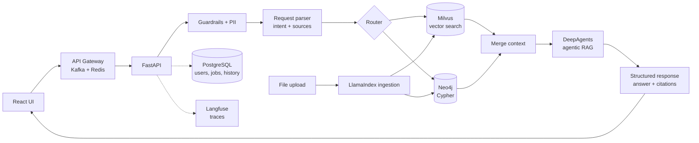

# rivet-kag

**Knowledge-Augmented Generation (KAG) over your own data.** Ask questions in natural language and get answers grounded in both a **vector store (Milvus)** and a **knowledge graph (Neo4j)**, with citations and source text for every claim.

> Status: early skeleton. The UI and API contract are working; retrieval, agent and infra pieces return stubbed data. See the [roadmap](#roadmap).

<!-- TODO: demo GIF -->

## Features

- Q&A chat with cited answers (vector chunks and graph facts, with source text)
- Hybrid retrieval: semantic search (Milvus) and Cypher queries (Neo4j) run in parallel
- Input guardrails and PII masking before anything reaches a model
- Agentic RAG with structured (Pydantic) output
- Upload Excel, CSV, Markdown and PDF files, ingested through LlamaIndex
- Tracing (Langfuse) and evals (DeepEval, 25 golden questions)
- Planned: user auth, agent actions (change data, analysis and plots)

## Architecture



### Request flow

1. User sends a request from the UI
2. The request is parsed to find the core need and the data sources to use
3. PII is detected and masked
4. The router decides what to query: Milvus, Neo4j (Cypher), or both
5. Vector and graph retrieval run in parallel
6. Results are merged into a single context
7. The context goes to the agentic RAG layer (DeepAgents)
8. The answer is produced as a validated Pydantic structure
9. The UI shows the answer with citations and source text

### Tech stack

| Layer | Choice |
|---|---|
| Frontend | React + TypeScript (Vite) |
| Backend | FastAPI |
| Gateway / async | Kafka, Redis (cache + sessions) |
| LLM orchestration | LangChain, DeepAgents |
| Ingestion | LlamaIndex |
| Vector DB | Milvus |
| Graph DB | Neo4j |
| Relational DB | PostgreSQL |
| Guardrails | Middleware on input |
| Observability | Langfuse |
| Evals | DeepEval |
| Packaging | Docker |

## Quickstart

Requires [uv](https://docs.astral.sh/uv/) and Node 18+ (uv installs Python 3.11+ itself). All Python commands run through `uv`.

```bash
make install         # uv sync + frontend deps
make dev-backend     # uv run uvicorn, http://localhost:8000 (docs at /docs)
make dev-frontend    # http://localhost:5173  (second terminal)
make test lint
```

Or with Docker: `make up` (app + Postgres + Redis, stub pipeline). Add `--profile full` to also start Kafka, Milvus and Neo4j. Copy `.env.example` to `.env` to configure.

API: `POST /api/chat` with `{"session_id": "...", "message": "..."}` returns `{answer, citations[], trace[]}`. `/api/auth/*` and `/api/files` return 501 until implemented.

## Project structure

```
src/                     backend (FastAPI), imported as `src.*`
  main.py, config.py     app factory, env-based settings
  api/                   routes (health, chat, auth, files) and dependencies
  pipeline/              stage interfaces (base.py), orchestrator, stubs, factory
  guardrails/            input checks (run before the pipeline)
  schemas/               Pydantic request/response models
  core/                  logging, error handling
  clients/ db/ ingestion/ observability/   placeholders for Milvus/Neo4j/Redis/Kafka, Postgres, LlamaIndex, Langfuse
tests/                   pytest suite
frontend/src/            React UI (ChatWindow, Citations)
infra/                   service config for docker compose
evals/  data/samples/    DeepEval suite and sample data (upcoming)
```

Each pipeline stage is a Protocol in `pipeline/base.py`. To add a real Milvus retriever, implement `Retriever` and register it in `pipeline/factory.py`.

## Roadmap

**Phase 0: skeleton**
- [x] README and architecture
- [x] FastAPI backend with stubbed pipeline and structured response
- [x] React chat UI with citations
- [x] Production layout: src package, settings, DI pipeline, guardrail hook, tests, CI, Dockerfiles, compose

**Phase 1: data and retrieval**
- [ ] Create sample dataset for vector and graph DBs
- [ ] Milvus + Neo4j via Docker Compose
- [ ] LlamaIndex ingestion (Excel, CSV, MD, PDF) and upload endpoint
- [ ] Real vector retrieval (Milvus) and Cypher generation (Neo4j)
- [ ] Request parser and router (LangChain)

**Phase 2: agent and safety**
- [ ] DeepAgents agentic RAG with Pydantic output
- [ ] Guardrails middleware and PII masking
- [ ] Context merge and reranking

**Phase 3: platform**
- [ ] User auth
- [ ] PostgreSQL for users, chat history and ingestion progress
- [ ] API gateway with Kafka (async messaging) and Redis (cache, sessions)
- [ ] Dockerize the full stack

**Phase 4: quality and polish**
- [ ] Langfuse tracing
- [ ] DeepEval with 25 golden questions
- [ ] Demo GIF

**Later**
- [ ] Agent actions: change data, analysis and plots

## License

MIT
