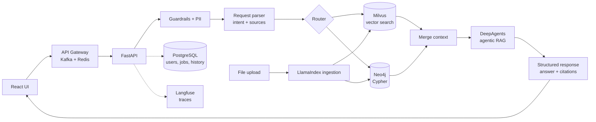

# Rivet KAG | Agent that talks to your vector and graph data

**Knowledge-Augmented Generation (KAG) over your own data.** Ask questions in natural language and get answers grounded in both a **vector store (Milvus)** and a **knowledge graph (Neo4j)**, with citations and source text for every claim.

> Status: early stage. The chat UI, API contract, sample data, upload tooling and a Data Management view (live Milvus and Neo4j contents) work. Chat answers are still stubbed: retrieval, the agent and the platform pieces are on the [roadmap](#roadmap).

<!-- TODO: demo GIF -->

## Features

- Q&A chat with cited answers (vector chunks and graph facts, with source text)
- Data Management tab: browse everything stored in Milvus and Neo4j
- Upload utilities to load your own data into both databases (`utils/`)
- Hybrid retrieval: semantic search (Milvus) and Cypher queries (Neo4j) run in parallel
- Input guardrails and PII masking before anything reaches a model
- Agentic RAG with structured (Pydantic) output
- Upload Excel, CSV, Markdown and PDF files, ingested through LlamaIndex
- Tracing (Langfuse) and evals (DeepEval, 25 golden questions)
- Planned: user auth, agent actions (change data, analysis and plots)

## Architecture



### Request flow

1. User sends a request from the UI
2. The request is parsed to find the core need and the data sources to use
3. PII is detected and masked
4. The router decides what to query: Milvus, Neo4j (Cypher), or both
5. Vector and graph retrieval run in parallel
6. Results are merged into a single context
7. The context goes to the agentic RAG layer (DeepAgents)
8. The answer is produced as a validated Pydantic structure
9. The UI shows the answer with citations and source text

### Tech stack

| Layer             | Choice                          |
| ----------------- | ------------------------------- |
| Frontend          | React + TypeScript (Vite)       |
| Backend           | FastAPI                         |
| Gateway / async   | Kafka, Redis (cache + sessions) |
| LLM orchestration | LangChain, DeepAgents           |
| Ingestion         | LlamaIndex                      |
| Vector DB         | Milvus                          |
| Graph DB          | Neo4j                           |
| Relational DB     | PostgreSQL                      |
| Guardrails        | Middleware on input             |
| Observability     | Langfuse                        |
| Evals             | DeepEval                        |
| Packaging         | uv (Python), npm (frontend)     |

## Quickstart

No Docker. You need [uv](https://docs.astral.sh/uv/) (installs Python 3.12 itself), Node 18+ and [Neo4j](https://neo4j.com/) installed locally. Milvus runs embedded (Milvus Lite) from a local file, so there is nothing to install for it.

```bash
brew install neo4j                                  # once; needs a JDK, Homebrew pulls one in
neo4j-admin dbms set-initial-password rivet-dev-password   # once, before the first start
make neo4j                                          # start Neo4j as a background service
make install                                        # uv sync + npm install
make ingest                                         # load source_data/ into Milvus and Neo4j
make dev                                            # API http://localhost:8000 (docs at /docs) and UI http://localhost:5173
```

Connection settings live in `.env` (copy `.env.example`); the defaults match the commands above. `make test lint` runs the checks.

API: `POST /api/chat` with `{"session_id": "...", "message": "..."}` returns `{answer, citations[], trace[]}`. `/api/data/*` feeds the Data Management tab. `/api/auth/*` and `/api/files` return 501 until implemented.

## Sample data

`source_data/` holds a synthetic company dataset: `vector_data/` (Markdown + CSV for Milvus) and `graph_data/` (node/relationship CSVs for Neo4j). See [source_data/README.md](source_data/README.md) for what is in it. Open `source_data/index.html` in a browser to explore it.

### Loading data into the databases

```bash
make ingest   # embed and load source_data/ into both (first run downloads a ~130 MB embedding model)
```

Milvus Lite keeps its data in `data/milvus.db`. The API and the upload CLI open it one operation at a time, so you can run `make ingest` while `make dev` is running.

`utils/` also handles manual uploads: `uv run python -m utils.upload --help`. For example `vector files my_notes.md`, `vector text "..." --source note`, `graph node Employee id=E13 name="Ada"`, `graph rel MEMBER_OF Employee:E13 Team:TM1`. Everything stored is visible in the **Data Management** tab of the UI.

## Project structure

```
src/                     backend (FastAPI), imported as `src.*`
  main.py, config.py     app factory, env-based settings
  api/                   routes (health, chat, data, auth, files) and dependencies
  pipeline/              stage interfaces (base.py), orchestrator, stubs, factory
  clients/               Milvus (Lite) session and Neo4j driver
  guardrails/            input checks (run before the pipeline)
  schemas/               Pydantic request/response models
  core/                  logging, error handling
  db/ ingestion/ observability/   placeholders for Postgres, LlamaIndex, Langfuse
utils/                   upload CLI: load data into Milvus and Neo4j
source_data/             sample data (vector_data/, graph_data/) and an HTML viewer
tests/                   pytest suite
frontend/src/            React UI (Chat, Data Management)
```

Each pipeline stage is a Protocol in `pipeline/base.py`. To add a real Milvus retriever, implement `Retriever` and register it in `pipeline/factory.py`.

## Roadmap

**Phase 0: Skeleton**

- [X] README and architecture
- [X] FastAPI backend with stubbed pipeline and structured response
- [X] React chat UI with citations
- [X] Project layout, uv tooling, tests and CI
- [X] Data Management tab

**Phase 1: Data and retrieval**

- [X] Create sample dataset for vector and graph DBs
- [X] Milvus (Lite) + Neo4j running locally, sample data loaded by `utils/`
- [ ] LlamaIndex ingestion (Excel, CSV, MD, PDF) and upload endpoint
- [ ] Real vector retrieval (Milvus) and Cypher generation (Neo4j)
- [ ] Request parser and router (LangChain)

**Phase 2: Agent and safety**

- [ ] DeepAgents agentic RAG with Pydantic output
- [ ] Guardrails middleware and PII masking
- [ ] Context merge and reranking

**Phase 3: Platform**

- [ ] User auth
- [ ] PostgreSQL for users, chat history and ingestion progress
- [ ] API gateway with Kafka (async messaging) and Redis (cache, sessions)
- [ ] Docker packaging of the full stack (postponed)

**Phase 4: Quality and polish**

- [ ] Langfuse tracing
- [ ] DeepEval with 25 golden questions
- [ ] Demo GIF

**ToDo next**

- [ ] Agent actions: change data, analysis and plots

## License

MIT, see [LICENSE](LICENSE).
