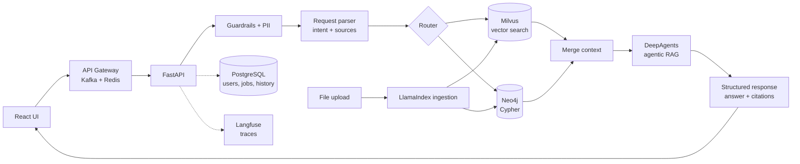

# Rivet KAG

**Production-minded Hybrid KAG: a chat agent that answers from your own data, grounded in both a vector store (Milvus) and a knowledge graph (Neo4j), with citations for every claim, real eval gates, guardrails, and cost controls — not just a RAG demo.**

> Details and verification notes live in [Real retrieval, routing and answering](#real-retrieval-routing-and-answering) and [Production readiness](#production-readiness); see the [Roadmap](#roadmap) to track work.


## Run it yourself

The chat pipeline has a **stub mode** that needs no database, no API key and no background service — this is also what `.env.example` and CI default to. Use this to see the UI and API shape before installing anything else:

```bash
git clone <this repo> && cd rivet_kag
cp .env.example .env     # defaults: USE_STUBS=true, no API key -- nothing below needs it
make install              # uv sync + npm install
make dev                  # API http://localhost:8000 (docs at /docs), UI http://localhost:5173
```

Open the UI and ask anything, or hit the API directly:

```bash
curl -X POST http://localhost:8000/api/chat \
  -H 'Content-Type: application/json' \
  -d '{"session_id": "demo", "message": "What is the expense policy?"}'
```

You'll get back a real `{answer, citations[], trace[]}` shape with canned citations and a canned answer — no Milvus, Neo4j, Postgres, Redis, Kafka, or LLM credentials needed; `make test` runs the same way. This is genuinely how far you can get with zero infrastructure, not a watered-down demo of a different code path — swapping in real retrieval and a real LLM later (see [Use real retrieval and LLMs](#use-real-retrieval-and-llms)) exercises the exact same routes.

See [Scope vs. a full agent platform](#scope-vs-a-full-agent-platform) for how this maps onto a
fuller production agent architecture (multi-agent orchestration, MCP tools, VLMs) and what plugging those in would look like.

## Architecture



### Request flow

1. User sends a request from the UI
2. The request is parsed to find the core need and the data sources to use
3. PII is detected and masked
4. The router decides what to query: Milvus, Neo4j (Cypher), or both
5. Vector and graph retrieval run in parallel
6. Results are merged into a single context
7. The context goes to the agentic RAG layer (DeepAgents), grounded strictly in the retrieved citations
8. The answer is produced as a validated Pydantic structure (`AgentAnswer`: answer, citations used, confidence)
9. The UI shows the answer with citations and source text

## Features

In the UI:

- Q&A chat with cited answers (vector chunks and graph facts, with source text)
- Data Management tab: browse everything stored in Milvus and Neo4j
- Per-request model picker (provider + model)

API-only (no UI for these yet — use `/docs`, `curl`, or the `utils/` CLI):

- JWT auth (`/api/auth/register`, `/login`, `/me`) — the UI doesn't have a login screen; chat/upload work logged-out too
- Agent actions: the answerer can *propose* a data edit (vector chunk text, graph node property); nothing is written until a human reviews and applies it (`GET /api/actions`, `POST /api/actions/{id}/apply`/`reject`) — entirely API-only today, including listing; there's no Data Management UI for this yet
- File upload ingestion (`POST /api/files`: Excel, CSV, Markdown, PDF, via LlamaIndex) and the `utils/` bulk-upload CLI
- Per-stage cost accounting, pre-flight budget checks, and session/batch spend circuit breakers (`src/pipeline/pricing.py`) — visible in `ChatResponse.trace[]`/`total_cost_usd`, not rendered in the UI
- Evals and release gates (`make eval`, `make judge`, `make deepeval`, `make gates`, `make alerts`) — see [Production readiness](#production-readiness)
- Local-only Langfuse tracing (never Langfuse Cloud)

Underlying design (not user-facing, but worth knowing about):

- Hybrid retrieval: semantic search (Milvus) and Cypher queries (Neo4j) run in parallel
- Input guardrails and regex-based PII masking, always on, before anything reaches an LLM
- Agentic RAG (DeepAgents) with Pydantic-validated structured output
- Redis response caching and Kafka event publishing, both best-effort — never block or fail a request
- Planned: analysis/plotting agent actions and the richer trace field set — see [Production readiness](#production-readiness)

### Tech stack

| Layer             | Choice                          |
| ----------------- | ------------------------------- |
| Frontend          | React + TypeScript (Vite)       |
| Backend           | FastAPI                         |
| Gateway / async   | Kafka, Redis (cache + sessions) |
| LLM orchestration | LangChain, DeepAgents           |
| Ingestion         | LlamaIndex                      |
| Vector DB         | Milvus                          |
| Graph DB          | Neo4j                           |
| Relational DB     | PostgreSQL                      |
| Guardrails        | Middleware on input             |
| Observability     | Langfuse                        |
| Evals             | DeepEval                        |
| Packaging         | uv (Python), npm (frontend)     |

### Scope vs. a full agent platform

This project implements the data/retrieval and LLOps layers of a production agent stack in full
(real vector+graph RAG, evals, tracing, guardrails, cost/latency controls — see
[Production readiness](#production-readiness)); a few layers a fuller platform would have are
deliberately out of scope here. One-liners on each, and how it currently works / how you'd wire
it in if needed:

- **Multi-agent orchestration (Planner/Research/Action agents).** Now: one agent (DeepAgents
  answerer) with two narrow write-proposal tools — see [Agent actions](#agent-actions). To add:
  split `src/pipeline/answering/agent.py` into a LangGraph graph with separate planner/
  research/action nodes and route between them instead of one agent loop.
- **MCP tools for SQL/APIs/SaaS.** Now: no MCP server; the two agent tools are plain LangChain
  functions scoped to proposing Milvus/Neo4j edits, not external systems. To add: stand up an MCP
  server exposing the SQL/API/SaaS calls you want, then bind it to the DeepAgents answerer the
  same way `src/pipeline/answering/tools.py`'s tools are bound today.
- **API gateway with Redis-backed session state.** Now: FastAPI *is* the gateway (no separate
  gateway service); Redis only caches `/api/chat` responses — auth is stateless JWT, so there's no
  session state to store. To add: if you need server-side sessions, add a Redis-backed session
  store keyed by JWT `jti`, separate from the existing response-cache keys in
  `src/clients/redis.py`.
- **VLM / multimodal input.** Now: text-only, no image/vision model support anywhere. To add: a
  new `llm_provider`-style branch in `src/pipeline/answering/agent.py`'s `_build_model`, plus an
  ingestion path for image chunks alongside the existing md/csv/xlsx/pdf loaders.

## Use real retrieval and LLMs

Everything in [Run it in 5 minutes](#run-it-in-5-minutes-no-services-required) used stubs. This
section swaps in real Milvus/Neo4j retrieval and a real LLM — same routes, same UI, just backed
by real infrastructure instead of canned responses. Two ways to get there: Homebrew services
(this project's default for routine local dev) or Docker (see
[Docker](#docker) below) if you'd rather not install four services directly.

You need [uv](https://docs.astral.sh/uv/) (installs Python 3.12 itself), Node 18+, and [Neo4j](https://neo4j.com/), [PostgreSQL](https://www.postgresql.org/), [Redis](https://redis.io/) and [Kafka](https://kafka.apache.org/) installed locally — all via Homebrew, all run as background services. Milvus runs embedded (Milvus Lite) from a local file, so there is nothing to install for it.

```bash
brew install neo4j postgresql@16 redis kafka         # once; neo4j and kafka need a JDK, Homebrew pulls one in
neo4j-admin dbms set-initial-password rivet-dev-password   # once, before Neo4j's first start
createuser -s rivet && createdb -O rivet rivet        # once, creates the app's Postgres role + database
make platform                                        # start neo4j, postgres, redis and kafka as background services
make install                                         # uv sync + npm install
make ingest                                          # load source_data/ into Milvus and Neo4j
make dev                                             # API http://localhost:8000 (docs at /docs) and UI http://localhost:5173
```

Connection settings live in `.env` (copy `.env.example`); the defaults match the commands above. Postgres tables are created automatically on startup (`Base.metadata.create_all`, not a migration tool — see `src/db/models.py`). `make test lint` runs the checks; the test suite never touches any of these services — see [Platform](#platform-auth-history-and-messaging).

After the one-time setup above, `make up` is a single command for routine local dev: it starts the four brew services if they aren't already running, polls their ports until each actually accepts a connection (not just until `brew services start` returns — Postgres/Neo4j/Kafka can take a few seconds to come up from cold), then runs `make dev`. This stays the default for day-to-day development (faster rebuilds, no container overhead) — see `CLAUDE.md`'s "Stack and why" for the original reasoning; Docker is available as an alternative, not a replacement.

### Docker

`docker-compose.yml` packages the whole stack — API, UI, Neo4j, Postgres, Redis, Kafka — for anyone who'd rather not install four services directly (a quick demo on a machine without Homebrew, for instance). Milvus still runs embedded even here: there's no Milvus server image, so the `api` container just gets the repo's `./data` directory bind-mounted, same `data/milvus.db` file either way.

```bash
cp .env.example .env          # optional: only needed to set ANTHROPIC_API_KEY/etc for a real LLM
make docker-up                 # builds and starts everything: API :8000, UI :5173
make docker-ingest              # once, after the containers are healthy: loads source_data/
```

`make docker-down` stops everything; `make docker-logs` tails all container logs. The `api` container talks to the other containers by their compose service name (`postgres`, `redis`, `kafka`, `neo4j`), not `localhost` — see `docker-compose.yml`'s `environment:` block. `USE_STUBS=false` by default here (all four services are already up), so real retrieval runs out of the box; `make docker-ingest` just needs to run once first, or vector/graph retrieval comes back empty rather than erroring. An `LLM_PROVIDER=ollama` setup needs Ollama running on the *host*, not in this compose file — `OLLAMA_HOST` defaults to `http://host.docker.internal:11434` to reach it.

Verified live: built both images, brought up all six containers (Neo4j/Postgres/Redis/Kafka all pass their healthchecks), and confirmed `/api/chat` end to end — real vector retrieval against the bind-mounted Milvus Lite file (the same data a Homebrew-based `make ingest` had already loaded), `/api/data/overview` showing real Milvus/Neo4j data through the frontend's nginx `/api` proxy, and the answerer/Kafka-publish stages degrading gracefully exactly as they do outside Docker (no Ollama running on the host in that test, and Kafka's topic auto-create racing the first publish — both logged and swallowed, the request still returned 200). The Anthropic/OpenAI LLM-backed happy path itself is unverified here for the same reason as everywhere else in this README (no funded key available).

API: `POST /api/chat` with `{"session_id": "...", "message": "..."}` returns `{answer, citations[], trace[]}`. `/api/data/*` feeds the Data Management tab. `POST /api/files` ingests an uploaded file (see [Uploading files](#uploading-files)). `/api/auth/register`, `/login` and `/me` handle JWT auth (see [Platform](#platform-auth-history-and-messaging)).

## Sample data

`source_data/` holds a synthetic company dataset: `vector_data/` (Markdown + CSV for Milvus) and `graph_data/` (node/relationship CSVs for Neo4j). See [source_data/README.md](source_data/README.md) for what is in it. Open `source_data/index.html` in a browser to explore it.

### Loading data into the databases

```bash
make ingest   # embed and load source_data/ into both (first run downloads a ~130 MB embedding model)
```

Milvus Lite keeps its data in `data/milvus.db`. The API and the upload CLI open it one operation at a time, so you can run `make ingest` while `make dev` is running.

`utils/` also handles manual uploads: `uv run python -m utils.upload --help`. For example `vector files my_notes.md report.xlsx manual.pdf`, `vector text "..." --source note`, `graph node Employee id=E13 name="Ada"`, `graph rel MEMBER_OF Employee:E13 Team:TM1`. Everything stored is visible in the **Data Management** tab of the UI.

### Uploading files

`POST /api/files` (multipart, field name `file`) accepts `.md`, `.csv`, `.xlsx`/`.xls`, `.pdf` and `.txt`, chunks it with [LlamaIndex](https://docs.llamaindex.ai/) readers, embeds the chunks and upserts them into Milvus — the same collection `make ingest` and the Data Management tab use:

```bash
curl -F "file=@notes.md" http://localhost:8000/api/files
# {"filename":"notes.md","doc_type":"md","chunks_upserted":3}
```

Markdown is split one chunk per `##` heading; CSV and Excel one chunk per row (via LlamaIndex's `PagedCSVReader` / `PandasExcelReader`); PDF one chunk per page (via `PDFReader`). Unsupported types get a 400, and a file with no extractable text gets a 422.

## Real retrieval, routing and answering

By default (`USE_STUBS=true`) the chat pipeline uses canned retrievers so it works with no databases running. Set `USE_STUBS=false` in `.env` (with `make neo4j` and `make ingest` already done) to switch `/api/chat` to real retrieval:

- **Vector (`src/pipeline/retrieval/milvus.py`)** — embeds the question and runs a cosine ANN search over the ingested chunks, returning the top 4 as citations with their similarity score.
- **Graph (`src/pipeline/retrieval/neo4j.py`)** — a lightweight, keyword-based Cypher *generator*: it strips stopwords from the question, builds a query that matches nodes whose `name`/`title`/`id` contains one of the remaining keywords, and returns each match's direct relationships as a citation (e.g. `Priya Nair (Employee) -[:LEADS]-> Data Platform (Team)`). This isn't an LLM-based NL-to-Cypher translator — see the router below for that — but the query really is built from the question and executed against Neo4j, not fixed.

Independently, set `ANTHROPIC_API_KEY` in `.env` to switch on two LLM-backed stages — neither needs the databases running, so both work with `USE_STUBS=true` too:

- **Request parser and router** (`src/pipeline/parsing/router.py`, LangChain + Claude) — classifies the question's intent and decides which retriever(s) to query, instead of always querying both. Uses `with_structured_output` against a small `RouterDecision` schema (`intent`, `sources`), so the model's choice is validated, not parsed out of free text. Anthropic-only; not affected by `LLM_PROVIDER`.
- **Answerer** (`src/pipeline/answering/agent.py`, [DeepAgents](https://docs.langchain.com/oss/python/deepagents/overview)) — synthesizes the final answer from the merged citations, constrained to a Pydantic `AgentAnswer` schema (`answer`, `citation_ids` — which context items it actually used, `confidence`). The system prompt instructs it to answer only from the given context and say so plainly when the context doesn't cover the question, rather than guess. Its model backend is picked by `LLM_PROVIDER` (`anthropic` default, `openai`, or `ollama` for a local server) — see [Model router](#model-router) below.

Both stages fail the same way: if the call fails (bad key, timeout, malformed output) it's caught and logged, and the stage falls back to something safe — the router falls back to querying both sources, the answerer falls back to showing the retrieved citations without synthesis. A bad LLM response degrades the answer, it never 500s the request; verified live against a real, deliberately invalid key for both stages.

### Model router

`LLM_PROVIDER` in `.env` picks the answerer's model backend — `anthropic` (default, needs `ANTHROPIC_API_KEY`), `openai` (needs `OPENAI_API_KEY`), or `ollama` (a local server at `OLLAMA_HOST`, default `http://localhost:11434`, no key). `src/pipeline/answering/agent.py`'s `_build_model` maps the provider to `ChatAnthropic`/`ChatOpenAI`/`ChatOllama`; `src/pipeline/factory.py`'s `_answerer_has_credentials` decides, per provider, whether the real `DeepAgentAnswerer` or `StubAnswerer` is used (Ollama always counts as "has credentials" — it's a local service, not a keyed API, the same reasoning as the always-real PII masker). The request parser/router stays Anthropic-only; switching `LLM_PROVIDER` only changes the answerer. Only the Anthropic path has been exercised against a live endpoint (a deliberately invalid key, real 401) — OpenAI and Ollama are untested beyond mocked unit tests and offline construction.

PII masking (`src/guardrails/pii.py`) is always on, independent of any API key — it's regex-based (email, phone, card and SSN-shaped strings get replaced with a `[REDACTED_...]` placeholder) and runs before the message reaches the router or the answerer, so masking never depends on having an LLM available. Input guardrails (`src/guardrails/input.py`) block a short list of prompt-injection phrasings before the pipeline runs at all.

`evals/check_retrieval.py` is a 30-question accuracy check against the *live* databases (unlike the mocked unit tests, it proves the retrievers find the right thing in the sample data). Run it with `make eval` after `make ingest`:

```
$ make eval
[PASS] What is the meal expense limit while travelling?
       expected top source 'expense_policy.md', got 'expense_policy.md — Limits'
...
30/30 correct (100%)
```

`evals/judge.py` (`make judge`) goes further: it runs the *actual* pipeline end to end — real retrieval, real router, real DeepAgents answer — and has Claude grade each answer against a reference (see [LLM-as-a-judge](#llm-as-a-judge)). Needs `ANTHROPIC_API_KEY` and costs real money to run (one answering call plus one judging call per question). Its request shape has been checked against the live API with the only key available in this environment — valid but out of credit — and gets a real `400` billing error, not a malformed-request error, but it hasn't been run end to end with a funded key yet. `evals/deepeval_suite.py` (`make deepeval`) is the fuller version — see [LLM-as-a-judge](#llm-as-a-judge) — verified the same way.

Both scripts are hand-rolled precursors to the "DeepEval, 25 golden questions" Phase 4 item — same idea, smaller and framework-free.

## Agent actions

The answerer can be given **write** capability — but only ever to *propose* a change, never to make one. This is an opt-in per request (`ChatRequest.allow_actions`, default `false`); when set, `DeepAgentAnswerer` binds two extra tools (`src/pipeline/answering/tools.py`) and a short addendum is appended to its system prompt explaining the propose-only contract. With `allow_actions` left at its default, these tools aren't bound at all — not just unused, structurally unavailable to that agent instance (`tests/test_agent.py::test_deep_agent_answerer_binds_action_tools_only_when_enabled`).

**Why propose-then-apply, not direct writes.** The answerer is driven by free-text chat input from anyone who can reach `/api/chat` — no audit trail, no undo, and prompt-injection-shaped input is exactly what it's designed to answer from. Giving it direct write access to Milvus/Neo4j would mean a bad or adversarial prompt causes a real, silent data change. A full LangGraph `interrupt_on` + checkpointer pause-mid-execution flow would close this more completely but is a much larger addition than this project's scope calls for (see [Development philosophy](CLAUDE.md)); instead, every write is split into two steps that can never be collapsed into one:

1. **Propose** (`src/pipeline/actions.py`'s `propose_vector_chunk_update`/`propose_graph_property_update`, called only via the two agent tools) — reads the current value (so there's an `old_value` to diff against), validates the target exists, and inserts a `DataEditProposal` row (Postgres: `session_id`, `kind`, `target`, `old_value`, `new_value`, `reason`, `status="pending"`). This step **never touches Milvus or Neo4j** — it's pure read-plus-audit-insert. The question's `session_id` and the collected proposal ids reach the tool only via `contextvars` (`current_session_id`, `proposed_ids`) set around the agent call in `DeepAgentAnswerer.answer`, never as a model-suppliable argument, so the agent can't forge whose session a proposal belongs to. The answer returned to the chat UI says a change is pending review and lists its id (`ChatResponse.proposed_action_ids`); it does not say the change has happened.
2. **Apply or reject** (`POST /api/actions/{id}/apply` / `/reject`, `src/api/routes/actions.py`) — a separate, human-initiated HTTP call with no agent involvement. Only `apply_proposal` ever writes to Milvus (`client.upsert`) or Neo4j (`SET n[$prop] = $value`); it re-checks the proposal is still `pending` (so it can't be applied or rejected twice) and records `decided_at`. A failure at apply time (target deleted since the proposal was made) marks the row `rejected` with an `error`, rather than raising.

**Scoping.** Graph property updates are restricted to `ALLOWED_GRAPH_LABELS` (`Employee`, `Team`, `Project`, `Tool`, `Document` — the labels that actually exist in `source_data/graph_data/*.csv`), checked before the label is interpolated into the Cypher string (labels can't be parameterized). Vector chunk updates re-embed the new text (`src/ingestion/embeddings.py`) and preserve the chunk's other fields (`source`, `doc_type`, `heading`, `chunk_index`) rather than overwriting them.

`GET /api/actions` (optional `?status=pending|applied|rejected`) lists proposals — entirely API-only today, there's no Data Management UI tab for this yet. Verified live end to end against real Postgres, Milvus and Neo4j, and against a local Ollama model actually choosing to call the propose tool from a natural-language request and the subsequent apply call performing the real Milvus write.

## Platform: auth, history and messaging

Phase 3. No stub/real split here — unlike the LLM pipeline stages, there's no meaningful "fake Postgres"; these pieces are real whenever the app runs, and are each written to degrade gracefully rather than need a flag.

- **Auth** (`src/auth/`, `POST /api/auth/register`, `/login`, `GET /me`) — email/password with Argon2 hashing (`passlib`), stateless JWTs (`pyjwt`, `JWT_SECRET`/`JWT_TTL_MINUTES` in `.env`). `/api/chat` and `/api/files` accept an optional `Authorization: Bearer` header — logged-in activity is attributed to the user, anonymous requests still work exactly as before. No server-side session store: a stateless JWT needs none, which is why Redis's role here is caching, not sessions, despite "Redis (cache, sessions)" in the architecture diagram.
- **Postgres** (`src/db/`, four tables — see `models.py`) — `users`; `chat_history` (one row per exchange, what a signed-in user could see of their own past chats); `chat_audit_log` (append-only, only ever stores the PII-*masked* question, richer fields than `chat_history`: outcome, sources queried, duration); `ingestion_jobs` (one row per `/api/files` upload, including failures). Tables are created with `Base.metadata.create_all` on startup, not Alembic migrations — the simpler, demo-appropriate choice.
- **Redis** (`src/clients/redis.py`) — `/api/chat` caches a response by a hash of the PII-masked question (keyed to the current `USE_STUBS`/`ANTHROPIC_API_KEY` mode, so switching modes never serves a stale-mode answer), TTL `RESPONSE_CACHE_TTL_SECONDS` (default 300s). A cache hit skips the whole pipeline — in `chat_audit_log`, `outcome="success_cached"` with `duration_ms=0` marks it.
- **Kafka** (`src/clients/kafka.py`) — publishes a `rivet.chat.completed` event (session, user, citation count, sources queried, duration) after every successful, non-cached chat response. Fire-and-forget: the HTTP response doesn't wait on it.

**All four of these are best-effort on the request path** — Postgres writes, the Redis cache, and the Kafka publish are each wrapped so a failure is logged and swallowed, never raised. A `/api/chat` call degrades to "no history/cache/event for this one request," it never 500s because a platform service is down; verified by pointing all three at unreachable hosts and confirming chat still returns 200. The *test suite* never talks to a live Postgres/Redis/Kafka at all: `tests/conftest.py`'s `db_session` fixture swaps in a real, in-memory SQLite database (genuine CRUD behavior, no live Postgres needed), and Kafka publishing is autouse-mocked for every test — the first version of that mock was itself a bug fix: a module-cached `AIOKafkaProducer`, once started inside one `pytest-asyncio` test's event loop, hangs forever if a later test (its own, different event loop) reuses it. Invisible in production, where uvicorn keeps one event loop for the app's whole life; see `tests/conftest.py` for the full story.

## Production readiness

Design targets for cost, quality and observability, tracked in the [roadmap](#roadmap) (Phase 4) — most of it is now implemented and live-verified, not just design: per-call and job-level cost accounting, release-gate enforcement, and an alerting check all have real code (see below for exactly what each one does and doesn't cover). What's still a design, not code: the richer trace field set, and real production alerting (a cron script stands in for Prometheus/Alertmanager/paging). The specific numeric thresholds throughout this section (latency targets, alert levels) are still starting points to retune once there's real production traffic to measure against — the *mechanism* for enforcing them is real, the *tuning* isn't.

### Cost controls (tokenomics)

**Per-stage cost accounting and the pre-flight budget rejection are implemented** (`src/pipeline/pricing.py`, wired into `src/pipeline/parsing/router.py` and `src/pipeline/answering/agent.py`). One **inspection** = one `/api/chat` request/response cycle. Target: **≤$0.15/inspection**, split into a per-stage budget so no single stage can blow the total:

| Stage                     | Spend driver              | Budget                                   | Notes                                                                                                                                                                              |
| ------------------------- | ------------------------- | ---------------------------------------- | ---------------------------------------------------------------------------------------------------------------------------------------------------------------------------------- |
| PII masking               | —                        | $0.00                                    | Regex/NER, no LLM call — masking is a bad place to spend tokens                                                                                                                   |
| Parse/route               | small classification call | ≤$0.01 (`PARSE_BUDGET_USD`)           | Structured output. Real cost computed from the router's`AIMessage.usage_metadata` (via `include_raw=True`) — no pre-flight gate, the stage is cheap enough it isn't worth one |
| Retrieve (vector + graph) | —                        | $0.00                                    | Local embedding (fastembed) + rule-based Cypher generation; only infra cost, no per-token spend                                                                                    |
| Merge / ROI-compress      | optional reranker         | ≤$0.005                                 | See below                                                                                                                                                                          |
| Answer synthesis          | agentic RAG               | ≤$0.12 (`ANSWER_BUDGET_USD`)          | The dominant cost: real cost summed across every`AIMessage` DeepAgents produces (it can round-trip the model more than once per request)                                         |
| **Total**           |                           | **≤$0.15 (`TOTAL_BUDGET_USD`)** | `ChatResponse.total_cost_usd` — logged as a warning if exceeded; `None` (not summed as $0) if any stage's model isn't in the pricing table                                    |

- **Pricing table** (`PRICING` in `src/pipeline/pricing.py`) — covers only the models this project's router/answerer can actually select (the router's Anthropic model, and `src/pipeline/models.py`'s `MODEL_CATALOG`). Ollama models are priced $0 (local compute, no per-token API cost). A model not in the table returns `cost_usd=None` — genuinely unknown, never guessed as free.
- **Pre-flight estimation** (`DeepAgentAnswerer._estimate_cost_usd`) — before the real agent call, count input tokens via the configured model's own `get_num_tokens_from_messages` on the assembled prompt: for Anthropic this calls the real `messages.count_tokens` API (verified live — see `CLAUDE.md`), for OpenAI it's a local `tiktoken` count, for Ollama a cheap local heuristic — each backend's best available method, no branching needed. Combined with a worst-case output estimate (`MAX_OUTPUT_TOKENS`, the same 1024-token cap passed to the model), if the estimate exceeds `ANSWER_BUDGET_USD` the real LLM call is skipped entirely and the context-only fallback answer is returned (`AnswerResult.budget_rejected=True`, `cost_usd=0.0` — no call was made, so nothing was spent). If the token count itself fails (network error, unsupported model), the budget check is skipped rather than blocking the request.
- **Actual cost accounting** — after a successful LLM call, `usage_from_ai_message` reads langchain's standardized `usage_metadata` (`input_tokens`, `output_tokens`, and Anthropic's `input_token_details.cache_read`/`cache_creation`) and `cost_usd` multiplies by the model's per-token price. This lands in `StageTrace` (`model`, `input_tokens`, `output_tokens`, `cost_usd`, `budget_rejected`) and the matching Langfuse span — see [Observability and audit trail](#observability-and-audit-trail).
- **Caching** — the answerer's system prompt is cached (`src/pipeline/answering/agent.py`'s `_build_system_prompt`): for `LLM_PROVIDER=anthropic` only (OpenAI caches automatically with no API to opt into; Ollama has no concept of it), the system prompt is sent as a `SystemMessage` with a `cache_control: {type: "ephemeral"}` breakpoint on its one content block. `create_deep_agent` preserves a `SystemMessage`'s content blocks and appends its own boilerplate as a further, uncached block, so the breakpoint still covers all of `SYSTEM_PROMPT`. Verified two ways: the actual formatted request `langchain_anthropic` sends was inspected directly and does carry `cache_control` (`tests/test_agent.py::test_build_system_prompt_cache_control_reaches_the_wire_format` — written after an initial version using `TextContentBlock`'s typed `extras` field turned out to be silently dropped by `_format_text_block`, which only reads a bare top-level key); and a live call against the real endpoint (with the known out-of-credit key) got the same `400` billing error as before `cache_control` was added, not a different "malformed request" error, confirming the request shape itself is accepted. **Tool-schema caching is not implemented** — DeepAgents builds its own built-in tool list (filesystem tools, task/subagent tools) internally and doesn't expose a hook to attach `cache_control` to it; doing this would mean forking or monkeypatching DeepAgents' internals, out of scope here. Repeat identical requests should show non-zero `cache_read_tokens` in the trace once a real (non-out-of-credit) Anthropic key is available to verify the cache actually hits — unverified so far for the same reason the rest of the Anthropic happy path is (see `CLAUDE.md`).
- **ROI compression** — before merged context reaches the answerer, rank citations and keep only the highest-value ones per token: drop low-relevance chunks, cap total context (default 2,000 tokens). This is `merge_context` (`src/pipeline/merge.py`): dedupe by id, rank by retriever score (unscored citations sort last), then greedily fill the token budget (cheap char-based estimate, no LLM call) — always keeping at least one citation even if it alone exceeds the budget. There's no summarization step; chunks are kept verbatim or dropped.
- **Job-level limits** — implemented, one level up from the per-request $0.15 cap above:
  - **Per-session** (`SESSION_DAILY_BUDGET_USD = $1.00`, `src/pipeline/pricing.py`) — `src/api/routes/chat.py`'s `_session_spend_24h` sums `chat_audit_log.cost_usd` for the request's `session_id` over a rolling 24h window (computed from the database's own `now()`, not a client-side timestamp — see the function's docstring for the real bug that taught this), and once a session is over the cap, passes `max_answer_cost_usd=0.0` into `Pipeline.run()`. This reuses the existing per-request pre-flight-rejection path (`DeepAgentAnswerer.answer`'s `max_cost_usd` param) rather than a new fallback mechanism: the request still runs retrieval and returns real citations, just with the context-only fallback answer instead of a real LLM call. Best-effort like every other platform read: if the spend can't be checked (Postgres down), it doesn't block — same as a Postgres outage degrading history/audit logging elsewhere.
  - **Per-batch-job** (`BATCH_JOB_BUDGET_USD = $5.00`) — `BatchBudget` (`src/pipeline/pricing.py`) is a simple in-process accumulator shared across one script run; `evals/judge.py`, `evals/deepeval_suite.py` and the latency/cost measurement pass in `evals/release_gates.py` all call `budget.check()` before each question and `budget.add(cost)` after, so `evals/release_gates.py` can pass one shared tracker across its whole run (retrieval + judge + deepeval + measurement) rather than each phase getting its own $5. Exceeding the limit raises `BudgetExceededError` — a genuine hard stop mid-run, not a logged warning the job ignores.
  - Verified live: the session breaker was confirmed end to end against real Postgres (a seeded over-cap session correctly got `budget_rejected: true` in the trace and a logged warning, while a normal session was unaffected); `make judge` and `make gates` both still reach the real Anthropic endpoint and fail for the same known out-of-credit reason as before these changes, confirming the budget bookkeeping doesn't change the request shape.

### Evaluation and release gates

A release (prompt change, retriever change, or model swap) ships only when every **blocking** gate below passes against the golden set (`evals/golden_questions.json` — 30 questions: 20 retrieval-only plus 10 with a `reference_answer` for judging, covering every sample document and a spread of the knowledge graph). **Warn** gates are reported, not enforced.

**Implemented**: `evals/gates.py` holds the pure threshold logic as data (unit-tested offline in `tests/test_gates.py` — no live service needed to test the *decision* logic), and `evals/release_gates.py` (`make gates`) gathers real metrics from a live run (`check_retrieval.py` + `judge.py` + `deepeval_suite.py` + measured latency/cost) and applies them, exiting 1 on any block. `.github/workflows/release-gates.yml` wires this into CI as a `workflow_dispatch` job — **manual, not on every push**, since this repo has no `ANTHROPIC_API_KEY` (or live Milvus/Neo4j) configured as a CI secret; wiring it into `push`/`pull_request` like `ci.yml` would just fail every run for a reason unrelated to the code, which would violate this project's "CI stays fully offline" rule (see `CLAUDE.md`). Whoever configures real credentials gets real enforcement; until then, the workflow exists and documents exactly what it needs.

| Dimension         | Metric                                                                                                                | Target                             | Gate                                                                      | Implementation                                                                                                              |
| ----------------- | --------------------------------------------------------------------------------------------------------------------- | ---------------------------------- | ------------------------------------------------------------------------- | --------------------------------------------------------------------------------------------------------------------------- |
| Retrieval quality | top-1 hit rate                                                                                                        | ≥90%                              | Blocking                                                                  | `evals/check_retrieval.py`                                                                                                |
| Answer quality    | LLM-judge correctness score, 1–5 (see below)                                                                         | mean ≥4.2, no individual score <3 | Blocking                                                                  | `evals/judge.py`                                                                                                          |
| Citation          | `FaithfulnessMetric` score, 0–1 (combines "hallucinated claims" and "uncited claims" into one number — see below) | ≥0.8                              | Blocking                                                                  | `evals/deepeval_suite.py`                                                                                                 |
| Latency           | P50 end-to-end`/api/chat`                                                                                           | ≤2.5s                             | Warn >2.5s, blocking >5s                                                  | measured during the`release_gates.py` run                                                                                 |
| Latency           | P95 end-to-end                                                                                                        | ≤6s                               | Warn >6s, blocking >10s                                                   | measured during the`release_gates.py` run                                                                                 |
| Cost              | mean $/inspection over the golden set                                                                                 | ≤$0.15                            | Warn >$0.15, blocking >$0.20                                              | `ChatResponse.total_cost_usd`, averaged                                                                                   |
| HITL              | sampled human review of production answers (5% of traffic, weekly)                                                    | ≥90% rated acceptable             | Below 90% blocks the next release until reviewed                          | **not implemented** — no production traffic exists to sample from; always reported as "not applicable", never blocks |
| HITL              | escalation rate ("I don't know" / handoff to a human)                                                                 | within 2× the 7-day baseline      | Blocking if exceeded — usually signals a retrieval or routing regression | **not implemented**, same reason                                                                                      |

### LLM-as-a-judge

Golden-string matching — what `evals/check_retrieval.py` does — only works for retrieval: it checks "did the right source come back", not "is the final answer correct." A synthesized answer has to be judged, not string-matched; this is what feeds the Answer quality and Citation rows above.

- **`evals/judge.py`** (`make judge`) — the simple version: runs the real pipeline against each golden question with a `reference_answer`, then has a Claude judge call score the answer 1–5, using a `JudgeVerdict` schema (`score`, `passed`, `rationale`) so the grade is structured, not parsed out of free text.
- **`evals/deepeval_suite.py`** (`make deepeval`, needs the `eval` uv group — `uv sync --group eval`) — the fuller version, using [DeepEval](https://docs.confident-ai.com/)'s `GEval` (a correctness rubric vs. the reference answer, scored 0–1) and `FaithfulnessMetric` (are the answer's claims actually supported by the retrieved context — the concrete implementation of the Citation gate). Both run against a custom `AnthropicJudgeModel` (`deepeval.models.DeepEvalBaseLLM` wrapping `ChatAnthropic`) rather than DeepEval's OpenAI-shaped defaults, so the judge is Claude like `judge.py`'s. Needs the `eval` dependency group specifically because `deepeval` registers a pytest plugin that calls `load_dotenv()` during pytest's plugin-loading phase — *before* `conftest.py`'s own dotenv neutering can run — so it's never installed by default and `pyproject.toml` carries `addopts = "-p no:deepeval"` as defense in depth even if someone runs tests with it installed (caught live while building this — see `CLAUDE.md`'s known gotchas).
- **Judge independence** — both scripts default to a different model tier for judging than the answerer typically runs (`claude-sonnet-5` judging, vs. the Haiku-class default answerer), to reduce self-preference bias.
- **Cost** — judge runs are an offline/batch job, not counted against the $0.15/inspection budget; tracked under the batch-job cap in [Cost controls](#cost-controls-tokenomics) instead.
- **Verified live, not just offline**: both scripts reach the real `api.anthropic.com` and fail for the expected reason (the same known out-of-credit `400` documented throughout this README), not a malformed-request error — proving the request shape, judge wrapper and golden-set plumbing are all correct even though the happy path itself is unverified (no funded key available in this environment).

### Observability and audit trail

**Langfuse tracing is implemented and local-only** (`src/clients/langfuse.py`, wired into `Pipeline.run()` in `src/pipeline/orchestrator.py`). `_is_local()` refuses any host that isn't `localhost`/`127.0.0.1` — it will never send a trace to Langfuse Cloud, regardless of `LANGFUSE_HOST`. There's no bundled local Langfuse server (self-hosting it needs Postgres + ClickHouse + Redis + object storage, which doesn't fit this project's brew-services-only platform story — see `CLAUDE.md`'s "Stack and why"); run your own self-hosted instance to see traces (https://langfuse.com/self-hosting). Without one, every span attempt fails to connect and is logged as a warning by Langfuse's own exporter — same "best-effort, never breaks the request" treatment as Postgres/Redis/Kafka (see [Platform](#platform-auth-history-and-messaging)): `traced_span()` degrades to a no-op context manager (`_NullSpan`) whenever the client is absent or a call fails, verified by `tests/test_tracing.py`.

**Per-request trace** (one root span per `Pipeline.run()` call, `as_type="chain"`) — implemented fields:

| Field                           | Description                                                                                                                           |
| ------------------------------- | ------------------------------------------------------------------------------------------------------------------------------------- |
| `session_id`                  | set in metadata at span start and again on every update                                                                               |
| `input`                       | the PII-masked question — set only after the "pii" stage, never`req.message` directly, so `question_raw` never reaches the trace |
| `output`                      | the final answer text                                                                                                                 |
| `sources_queried`, `intent` | which of vector/graph were queried, and the router's intent classification                                                            |
| `citations_count`             |                                                                                                                                       |
| `total_cost_usd`              | `ChatResponse.total_cost_usd` — sum of the per-stage `cost_usd` values, `None` if any stage's model is unpriced                |
| `outcome`                     | `success` / `guardrail_blocked` / `error`                                                                                       |

Not yet implemented: `total_latency_ms` as a distinct rollup field (the per-stage `duration_ms` values are there, just not pre-summed), token counts at the request level (they're per-stage — see below), and a `fallback_used` outcome value (the router/answerer's own fallback is logged but not yet surfaced into this field).

**Per-stage trace** (one child span per `timed()`/`timed_llm()` call in the orchestrator, automatically nested under the request's root span via Langfuse's OTel context) — implemented, matching `StageTrace` in `src/schemas/chat.py`: `name`, `detail` (as metadata), `duration_ms` (as output), and for the LLM-backed stages (parse, answer) `model`, `input_tokens`, `output_tokens`, `cost_usd`, `budget_rejected` — see [Cost controls](#cost-controls-tokenomics) for how these are computed. Not yet implemented: `cache_read_tokens` as its own trace field (it's used in the cost calculation but not surfaced separately), `query_used`/`num_results`/`top_score` for vector retrieve, `keywords`/`num_nodes_matched` for graph retrieve, and per-stage `error` detail — these need widening the `Retriever` protocol to expose more than the citations it returns today.

**Audit log** — append-only Postgres `chat_audit_log` is real (see [Platform](#platform-auth-history-and-messaging)), one row per request. It only stores `question_masked`, never the raw question — the audit trail must not become a second place PII leaks from. Today's table: `session_id`, `user_id`, `question_masked`, `answer`, `sources_queried`, `citations_count`, `outcome`, `duration_ms`, `cost_usd` (`ChatResponse.total_cost_usd`, added alongside `evals/check_alerts.py` specifically to feed its "mean cost/request" condition — `None` whenever any stage's cost is unknown, never a guessed $0). What's still a design, not code: 90-day retention (no expiry job runs yet) and per-stage token counts. Note: this table's schema is created with `Base.metadata.create_all` (not a migration tool — see `src/db/models.py`), which only creates *missing* tables; an existing live Postgres from before `cost_usd` was added needs a manual `ALTER TABLE chat_audit_log ADD COLUMN cost_usd double precision;` to pick it up.

**Alert conditions**: implemented as a stand-in for a real alerting pipeline — `evals/alerts.py` (pure threshold logic, unit-tested offline in `tests/test_alerts.py`) + `evals/check_alerts.py` (`make alerts`, reads live `chat_audit_log` rows). This is a manual/cron script, not real alerting: there's no Prometheus/Alertmanager, no paging integration, and the "Page" actions below (force a cheaper model, auto-rollback) aren't automated — the script only reports which level each condition is at.

| Condition                                   | Threshold                  | Action                                                                         | Computable today?                                                               |
| ------------------------------------------- | -------------------------- | ------------------------------------------------------------------------------ | ------------------------------------------------------------------------------- |
| Mean cost/request, 15 min rolling           | >$0.15                     | Warn                                                                           | Yes —`chat_audit_log.cost_usd`                                               |
| Mean cost/request, 15 min rolling           | >$0.30                     | Page + force the cheaper model / stub answerer                                 | Yes (reported only; no auto-switch)                                             |
| P95 latency, 5 min                          | >6s                        | Warn                                                                           | Yes —`chat_audit_log.duration_ms`                                            |
| P95 latency, 5 min                          | >15s                       | Page                                                                           | Yes (reported only)                                                             |
| 5xx / guardrail-block rate, 10 min          | >2%                        | Warn                                                                           | Yes —`chat_audit_log.outcome`                                                |
| 5xx / guardrail-block rate, 10 min          | >10%                       | Page + auto-rollback to the previous prompt/model version                      | Yes (reported only; no auto-rollback)                                           |
| Router fallback rate, 30 min                | >20%                       | Warn — LLM router likely failing or misconfigured                             | **No** — the router's own fallback isn't recorded in `chat_audit_log`  |
| Empty-result rate (vector or graph), 30 min | >15%                       | Warn — index or data problem                                                  | Yes —`chat_audit_log.citations_count`                                        |
| Judge-flagged hallucination rate, daily     | >5% of sampled answers     | Page — quality regression                                                     | **No** — no scheduled judge run against production traffic exists        |
| Guardrail trip rate                         | >3× the 7-day baseline    | Warn — possible prompt-injection campaign                                     | **No** — needs a stored 7-day rolling baseline this project doesn't keep |
| Prompt cache hit rate                       | <50% of its 7-day baseline | Warn — silent cache invalidator, see[Cost controls](#cost-controls-tokenomics) | **No**, same reason                                                       |

Verified live: pointed at real traffic generated through `make dev`, the four computable conditions correctly read non-trivial values (P95 latency, 0% error rate, 0% empty-result rate) from live rows; cost showed "not computable" *for that specific traffic* because the router's own known out-of-credit-key failure poisons `total_cost_usd` to `None` on every request in this environment (see `CLAUDE.md`), not because the wiring is broken. Caught and fixed a real bug while verifying this: the first version compared a Python-computed UTC timestamp against `chat_audit_log.created_at` (`TIMESTAMP WITHOUT TIME ZONE`, populated by Postgres's own `now()`) and silently returned zero rows whenever the client and server clocks disagreed — not a hypothetical, it actually happened live (~4 hours off). Fixed by computing every window boundary with Postgres's own `now()` instead of a client-side timestamp.

## Project structure

```
src/                     backend (FastAPI), imported as `src.*`
  main.py, config.py     app factory, env-based settings
  api/                   routes (health, chat, data, auth, files) and dependencies
  pipeline/              stage interfaces (base.py), orchestrator, stubs, factory
  pipeline/retrieval/    real retrievers: milvus.py (vector search), neo4j.py (Cypher generation)
  pipeline/parsing/      real request parser: router.py (LangChain + Claude, structured output)
  pipeline/answering/    real answerer: agent.py (DeepAgents + Claude, Pydantic-validated output)
  ingestion/             LlamaIndex loaders (md/csv/xlsx/pdf), embeddings, embed+upsert pipeline
  auth/                  password hashing (Argon2) and JWT issuance/verification
  db/                    SQLAlchemy models (users, chat_history, chat_audit_log, ingestion_jobs), async engine
  clients/               Milvus (Lite) session, Neo4j driver, Redis client, Kafka producer
  guardrails/            input.py (prompt-injection blocklist), pii.py (regex PII masking, always on)
  schemas/               Pydantic request/response models
  core/                  logging, error handling
  observability/         placeholder for Langfuse
utils/                   CLI: bulk-load source_data/ and manual uploads into Milvus and Neo4j
evals/                   golden_questions.json (30), live retrieval/judge/DeepEval checks, release gates, alerting — see evals/README.md
source_data/             sample data (vector_data/, graph_data/) and an HTML viewer
tests/                   pytest suite
frontend/src/            React UI (Chat, Data Management)
```

Each pipeline stage is a Protocol in `pipeline/base.py`. `pipeline/factory.py` selects stub or real retrievers based on `USE_STUBS`, and the LangChain router / DeepAgents answerer whenever `ANTHROPIC_API_KEY` is set. PII masking has no stub variant — it's always the real, regex-based masker.

## Roadmap

**Phase 0: Skeleton**

- [X] README and architecture
- [X] FastAPI backend with stubbed pipeline and structured response
- [X] React chat UI with citations
- [X] Project layout, uv tooling, tests and CI
- [X] Data Management tab

**Phase 1: Data and retrieval**

- [X] Create sample dataset for vector and graph DBs
- [X] Milvus (Lite) + Neo4j running locally, sample data loaded by `utils/`
- [X] LlamaIndex ingestion (Excel, CSV, MD, PDF) and upload endpoint
- [X] Real vector retrieval (Milvus) and Cypher generation (Neo4j)
- [X] Request parser and router (LangChain)

**Phase 2: Agent and safety**

- [X] DeepAgents agentic RAG with Pydantic output
- [X] Guardrails middleware and PII masking
- [X] Context merge, reranking and ROI compression (trim to the highest-value tokens before the answerer — see [Cost controls](#cost-controls-tokenomics))

**Phase 3: Platform**

- [X] User auth
- [X] PostgreSQL for users, chat history, ingestion progress and the audit trail (`chat_audit_log`)
- [X] Kafka (async messaging) and Redis (cache) — see [Platform](#platform-auth-history-and-messaging) for scope (an event publisher and a response cache, not a separate gateway service)
- [X] Docker packaging of the full stack — `docker-compose.yml` + `Dockerfile`s, an alternative to the Homebrew-services path, not a replacement for it — see [Docker](#docker)

**Phase 4: Quality and polish** — see [Production readiness](#production-readiness) for the full design

- [X] Langfuse tracing, local-only, with the per-request/per-stage fields buildable from what the pipeline returns today (token/cost/model fields wait on the item below)
- [X] Per-stage cost accounting (`response.usage` → `cost_usd`) and the $0.15/inspection budget, with pre-flight `count_tokens` rejection
- [X] Prompt caching for the answerer's system prompt (Anthropic only); tool-schema caching isn't possible without forking DeepAgents internals — see [Cost controls](#cost-controls-tokenomics)
- [X] DeepEval with 30 golden questions, including LLM-as-a-judge (`GEval`, `FaithfulnessMetric`) — `evals/deepeval_suite.py` (`make deepeval`)
- [X] Release gates: quality/latency/cost/citation thresholds, manually enforceable in CI — `evals/gates.py` (pure, unit-tested) + `evals/release_gates.py` (`make gates`) + `.github/workflows/release-gates.yml` (`workflow_dispatch`, needs a real `ANTHROPIC_API_KEY` secret this repo doesn't have — see the workflow file). HITL thresholds are intentionally never enforced: no production traffic exists to sample from.
- [X] Alerting on the conditions in [Observability and audit trail](#observability-and-audit-trail) — `evals/alerts.py` (pure, unit-tested) + `evals/check_alerts.py` (`make alerts`), reading real `chat_audit_log` rows. 4 of 6 conditions are genuinely computable today; 2 aren't (see below) — this is a manual/cron script, not a real alerting pipeline (no Prometheus/Alertmanager/paging integration exists in this project).
- [X] Agent functionality for edit/update — propose-then-human-apply, opt-in per request (`allow_actions`) — see [Agent actions](#agent-actions)
- [X] Demo GIF — `docs/demo.gif`, recorded against the real UI (stub-mode chat, Data Management against live Milvus/Neo4j)

## License

MIT, see [LICENSE](LICENSE).
